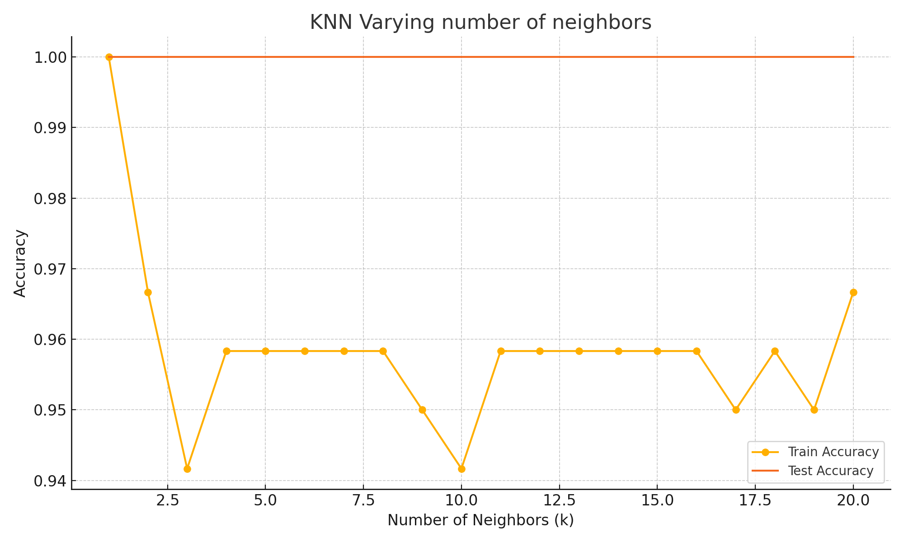

# Iris Flower Classification using K-Nearest Neighbors (KNN)

This project demonstrates how to classify iris flowers into three species using the K-Nearest Neighbors algorithm in Python.

## Features
- Loads and explores the Iris dataset
- Preprocesses the data with feature standardization
- Trains and evaluates a KNN model
- Visualizes training and testing accuracy over varying k values
- Saves confusion matrix and classification report to a file

## How to Run

### 1. Install requirements:
```bash
pip install -r requirements.txt
```

### 2. Run the script:
```bash
python iris_knn_classifier.py
```

### Output:
- `model_report.txt`: contains model performance metrics
- `knn_accuracy_plot.png`: visual accuracy comparison chart

## Example Chart


## Tools Used
- Python
- pandas, numpy
- scikit-learn
- matplotlib

## Author
Your Name - [LinkedIn](https://www.linkedin.com/in/your-profile) | [GitHub](https://github.com/your-username)
